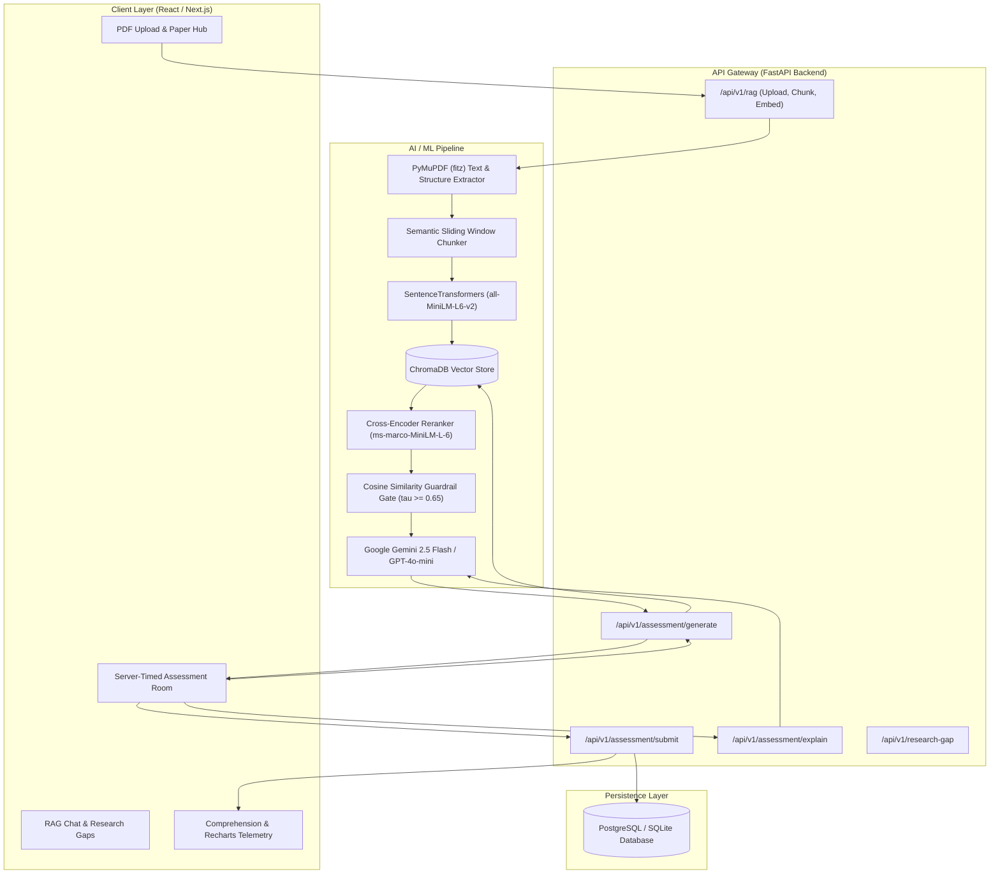

# Architectural Implementation Plan: Merging ResearchMate & SkillPulse

**Project Codename:** **ResearchPulse AI** (*AI Research Comprehension & Automated Assessment Platform*)  
**Source Repositories:**  
- Core AI/ML RAG Engine: [ResearchMate](https://github.com/hariom888/ResearchMate.git)  
- Assessment, Timing & Analytics Engine: [SkillPulse](https://github.com/Mahakdeep10212/quiz-management-and-assessment-platform.git)

---

## 1. Executive Summary & Objective

### 1.1 The Problem
Current academic workflows force researchers and students to read dense scientific PDFs passively. Existing paper-reading tools (chatbots) only support reactive Q&A, where users often fail to identify flawed assumptions, misinterpret mathematical methodologies, or overlook benchmark limitations.

### 1.2 The Solution
**ResearchPulse AI** merges **ResearchMate's** RAG pipeline (PDF ingestion, chunking, dense vector retrieval, cross-encoder reranking, multi-paper comparison, and research gap discovery) with **SkillPulse's** automated assessment engine, anti-cheat examination runtime, and personalized AI tutoring.

The resulting platform:
1. Indexes uploaded academic papers into **ChromaDB** using **SentenceTransformers** (`all-MiniLM-L6-v2`).
2. Applies a **two-stage retrieval pipeline** (Bi-Encoder retrieval + Cross-Encoder reranking) with **hallucination guardrails**.
3. Dynamically synthesizes **citation-grounded technical assessments** (MCQs + conceptual drills) testing methodology, empirical findings, and mathematical foundations.
4. Hosts a **server-timed assessment room** to validate user comprehension with instant scoring.
5. Deploys an **interactive AI Tutor** that resolves candidate misconceptions using verified citations (`[Paper, Section, Page]`).

---

## 2. High-Level System Architecture



---

## 3. Core Component Breakdown

### 3.1 Document Ingestion & Chunking Pipeline (ResearchMate)
* **Extraction:** `PyMuPDF` (`fitz`) extracts clean text while preserving document structural metadata: `paper_title`, `section_title`, `page_number`.
* **Chunking Strategy:** Semantic sliding-window chunking:
  * Chunk Size: 512 tokens (~1800 characters)
  * Overlap Stride: 64 tokens (~250 characters)
  * Metadata injection per chunk: `{"paper_id": str, "title": str, "section": str, "page": int}`

### 3.2 Two-Stage Retrieval with Hallucination Guardrails
* **Stage 1 (Bi-Encoder Dense Retrieval):** Query ChromaDB using vector cosine similarity to retrieve candidate $K_1 = 20$ chunks.
* **Stage 2 (Cross-Encoder Reranking):** Pass `(query, chunk_text)` pairs through `cross-encoder/ms-marco-MiniLM-L-6-v2` to obtain granular relevance logits, slicing to Top $K_2 = 5$ chunks.
* **Guardrail Gate:** If $\max(\text{similarity\_score}) < 0.65$, abort quiz synthesis with:
  `"Insufficient empirical evidence in uploaded papers to construct a rigorous assessment for this topic."`

### 3.3 Assessment Synthesis Engine (SkillPulse + ResearchMate)
When generating quizzes from ingested research papers:
* **Focus Areas:**
  1. *Methodology & Architecture* (e.g., neural layer counts, loss functions, optimization tricks).
  2. *Empirical Results & Benchmarks* (e.g., baseline comparisons, ablation impacts, p-values).
  3. *Theoretical Foundations & Assumptions* (e.g., convexity constraints, dataset biases).
* **Citation Mandate:** Every question must include the exact citation pointer back to the PDF source:
  `{"paper_title": "...", "section": "Section 3.2", "page": 4, "snippet": "..."}`.

### 3.4 Examination Room & Anti-Tamper Logic (SkillPulse)
* **Server-Authoritative Clock:** Test start timestamp ($T_{\text{start}}$) is recorded on the server. Submission at $T_{\text{submit}}$ validates:
  $$\Delta T = T_{\text{submit}} - T_{\text{start}} \le \text{duration} + \epsilon$$
  Any client clock manipulation or delayed payload is automatically flagged and rejected.
* **Auto-Submission:** Frontend WebSocket/polling triggers auto-submission when timer hits zero.

### 3.5 Grounded AI Tutor & Misconception Analysis
* Explains why distractor options are technically incorrect based on the paper's findings.
* Flags common misconceptions in academic literature.
* Links directly to the paper's **Future Work / Research Gap** section for further investigation.

---

## 4. API Specification & Data Contracts

### 4.1 Generate Quiz Endpoint
`POST /api/v1/assessment/generate`

#### Request Payload:
```json
{
  "paper_ids": ["paper_uuid_1", "paper_uuid_2"],
  "focus_area": "METHODOLOGY",
  "difficulty": "HARD",
  "question_count": 5
}
```

#### Response Payload (Structured JSON):
```json
{
  "assessment_id": "eval_98124a",
  "title": "Attention Mechanisms & Multi-Head Projections Assessment",
  "duration_minutes": 15,
  "passing_score": 70,
  "questions": [
    {
      "id": "q1",
      "question_text": "Why is the scaling factor 1/sqrt(d_k) introduced in the Scaled Dot-Product Attention?",
      "difficulty": "HARD",
      "options": [
        { "id": "opt_a", "text": "To prevent pushing the softmax function into regions with extremely small gradients", "is_correct": true },
        { "id": "opt_b", "text": "To reduce computational complexity from O(N^2) to O(N)", "is_correct": false },
        { "id": "opt_c", "text": "To enforce orthogonality across key and query projection spaces", "is_correct": false },
        { "id": "opt_d", "text": "To normalize the sequence length dimension across attention heads", "is_correct": false }
      ],
      "citation": {
        "paper_title": "Attention Is All You Need",
        "section": "Section 3.2.1",
        "page": 4,
        "evidence": "We suspect that for large values of d_k, the dot products grow large in magnitude, pushing the softmax function into regions where it has extremely small gradients."
      }
    }
  ]
}
```

### 4.2 Submit & Evaluate Attempt Endpoint
`POST /api/v1/assessment/submit`

#### Request Payload:
```json
{
  "assessment_id": "eval_98124a",
  "answers": {
    "q1": "opt_a"
  },
  "time_taken_seconds": 320
}
```

#### Response Payload:
```json
{
  "attempt_id": "att_4412",
  "score": 100.0,
  "percentage": 100.0,
  "passed": true,
  "correct_count": 1,
  "incorrect_count": 0,
  "time_taken": 320,
  "comprehension_rating": "Mastery",
  "breakdown": [
    {
      "question_id": "q1",
      "user_selected": "opt_a",
      "is_correct": true,
      "tutor_explanation": "Correct! As noted in Section 3.2.1, large dot products lead to vanishing gradients in softmax; scaling by 1/sqrt(d_k) counteracts this effect."
    }
  ]
}
```

---

## 5. Unified Project Directory Structure

```
ResearchPulse/
├── backend/                              # FastAPI Python Service (ResearchMate Priority)
│   ├── app/
│   │   ├── api/
│   │   │   └── v1/
│   │   │       ├── endpoints/
│   │   │       │   ├── rag.py            # PDF upload, chunking, indexing
│   │   │       │   ├── chat.py           # Paper Q&A with citations
│   │   │       │   ├── comparison.py     # Multi-paper comparative matrix
│   │   │       │   ├── research_gap.py   # Unexplored gaps discovery
│   │   │       │   └── assessment.py     # [NEW] Quiz synthesis, timing, grading
│   │   ├── modules/
│   │   │   ├── pdf_extractor.py          # PyMuPDF parser
│   │   │   ├── chunker.py                # Sliding-window semantic splitter
│   │   │   ├── vector_store.py           # ChromaDB client & embeddings
│   │   │   ├── reranker.py               # Cross-Encoder model
│   │   │   ├── guardrails.py             # Similarity gate & hallucination check
│   │   │   └── quiz_engine.py            # [NEW] Prompt templates & structured JSON generator
│   │   ├── core/
│   │   │   ├── config.py                 # App settings & API keys
│   │   │   └── security.py               # JWT auth & session handling
│   │   └── main.py
│   ├── requirements.txt
│   └── Dockerfile.backend
│
├── frontend/                             # Next.js 16 / React 19 Workspace (SkillPulse UI)
│   ├── src/
│   │   ├── app/
│   │   │   ├── dashboard/                # Research overview & comprehension stats
│   │   │   ├── papers/                   # PDF Library, Upload, Comparison table
│   │   │   ├── chat/                     # Grounded Paper RAG Chatbot
│   │   │   ├── assessment/               # [SkillPulse] Timed Exam Room & MCQs
│   │   │   └── results/                  # [SkillPulse] Score Breakdown & AI Tutor Review
│   │   ├── components/
│   │   │   ├── Timer.jsx                 # Synchronized countdown clock
│   │   │   ├── CitationBadge.jsx         # Clickable paper source preview
│   │   │   ├── QuestionCard.jsx          # MCQ option selection
│   │   │   ├── TutorModal.jsx            # Deep misconception analysis
│   │   │   └── AnalyticsChart.jsx        # Recharts mastery trajectory
│   │   └── lib/
│   │       └── api.js                    # Axios client connecting to FastAPI backend
│   ├── package.json
│   └── Dockerfile.frontend
│
└── docker-compose.yml                    # Unified orchestration (FastAPI + Next.js + ChromaDB)
```

---

## 6. Step-by-Step Implementation Roadmap

### Phase 1: RAG Engine Setup & Vector Ingestion (Backend)
- [ ] Set up FastAPI project with `PyMuPDF`, `sentence-transformers`, and `chromadb`.
- [ ] Implement sliding-window chunking (512 tokens / 64-token overlap) preserving page and section metadata.
- [ ] Verify embedding generation using `all-MiniLM-L6-v2`.
- [ ] Validate document query retrieval in ChromaDB.

### Phase 2: Reranking & Hallucination Guardrails
- [ ] Load `cross-encoder/ms-marco-MiniLM-L-6-v2` to rerank Top-20 Bi-Encoder candidate chunks to Top-5.
- [ ] Implement strict cosine threshold checks ($\tau \ge 0.65$) to prevent out-of-context generation.

### Phase 3: Assessment Generation Module (`quiz_engine.py`)
- [ ] Connect Google Gemini 2.5 Flash (`gemini-2.5-flash`) with structured JSON schema output (`response_mime_type="application/json"`).
- [ ] Formulate few-shot prompt forcing questions to test methodology/empirical findings with mandatory paper citations.
- [ ] Implement fallback heuristic parser in case of LLM schema parsing failure.

### Phase 4: Frontend Assessment Room Integration (SkillPulse Port)
- [ ] Port SkillPulse's `attempt` page, timer component, and option selector into the frontend.
- [ ] Implement server-synchronized timer to enforce anti-cheat deadlines.
- [ ] Add citation expandable badges on the results screen displaying the exact excerpt from the PDF.

### Phase 5: AI Tutor & Misconception Breakdown
- [ ] Implement `/api/v1/assessment/explain` endpoint.
- [ ] Provide tailored feedback analyzing candidate misconception, underlying scientific principle, and memory takeaway.
- [ ] Build Recharts radar chart displaying topic mastery across reading lists.

---

## 7. Quality Assurance & ML Evaluation Metrics

To evaluate this AI/ML platform rigorously for technical interviews and production:

1. **RAG Triad Metrics (via `Ragas` / TruLens):**
   * **Context Recall:** Does the retrieval pipeline capture all paper sections needed to answer the question?
   * **Context Precision:** Are the Top-5 reranked chunks directly relevant to the topic?
   * **Faithfulness / Groundedness:** Are 100% of the generated questions and options factual according to the paper context? (Target: $>0.95$).
2. **Assessment Discriminative Power:**
   * Distractor plausibility index (ensuring wrong options are realistic scientific misconceptions, not obvious throwaways).
3. **Latency Benchmarks:**
   * Vector Retrieval + Cross-Encoder Reranking: $<250\text{ms}$.
   * Gemini 2.5 Flash Quiz Synthesis (5 MCQs): $<2.5\text{s}$.

---

## 8. Recruiter-Ready CV Project Entry

• **ResearchPulse-AI | AI Research Workspace & Assessment Platform** | [GitHub](https://github.com/hariom888/ResearchMate) &nbsp; May 2026  
• Built an end-to-end RAG platform indexing academic PDFs into ChromaDB using `all-MiniLM-L6-v2` embeddings with cross-encoder reranking and cosine similarity guardrails ($\tau \ge 0.65$).  
• Engineered an automated assessment engine using Gemini 2.5 Flash with structured JSON output, synthesizing citation-grounded evaluation quizzes directly from paper methodologies in <3s.  
• Developed server-timed exam rooms with auto-submission and built an interactive AI tutor providing contextual misconception breakdowns grounded in paper citations.  
**Tech:** Python, FastAPI, PyMuPDF, ChromaDB, Sentence-Transformers, Cross-Encoder, Gemini 2.5 Flash, React, Next.js, Recharts, Tailwind CSS
